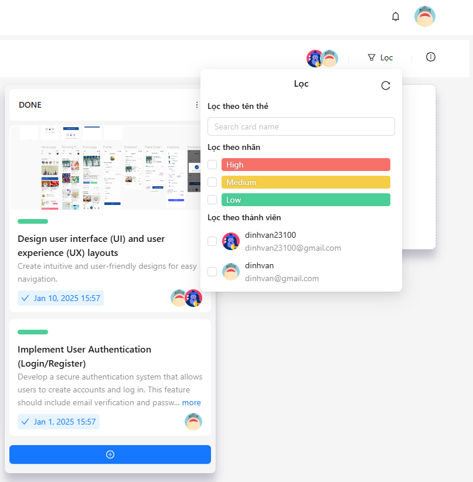

## Kanban app 


This is a simple kanban app that allows you to create, edit, delete and move tasks between columns. 

This is useful for users who want to keep track of their tasks and manage them in a visual way, sharing them with other users. 

## Features

- Login, Register, Logout, Edit Profile 
- Send real-time notifications to users using websockets
- Assign Card to Users, Set Due Date, Set Labels, Set List of Tasks must be done to complete the card
- Drag and Drop Card between Columns - Real-time Updates with WebSockets
- Search and Filter Card by Label, Due Date, or Assignee
- Responsive Design for Mobile and Desktop 
- Multi-Language Support (English, Vietnamese)
- Dark Mode and Light Mode

## Screenshots

1. Light Mode





2. Dark Mode


## Installation

1. Clone the repository

```bash
git clone 
```

2. Install the dependencies

```bash
cd kanban-fe
npm install
```
```bash
cd kanban-be
pip install -r requirements.txt
```

3. Create a `.env` file in the root of the project and add the following environment variables

```bash
# Frontend
NEXT_PUBLIC_BASE_URL=http://localhost:8000
NEXT_PUBLIC_NEXT_SERVER_URL=http://localhost:3000
```

4. Configure the backend

```bash
cd kanban-be
cd main/settings.py
```

Change the database settings to your own database settings

```python
DATABASES = {
    'default': {
        'ENGINE': 'django.db.backends.mysql',
        'NAME': 'YOUR_DATABASE_NAME',
        'USER': 'YOUR_DATABASE',
        'PASSWORD': 'YOUR_PASSWORD',
        'HOST': 'YOUR_HOST',
        'PORT': 'YOUR_PORT',
    }
}
```

Config channels layer to use Redis

```python
CHANNEL_LAYERS = {
    "default": {
        "BACKEND": "channels_redis.core.RedisChannelLayer",
        "CONFIG": {
            "hosts": [("YOUR_REDIS_HOST", 6379)],
        },
    },
}
```

5. Run the backend server

```bash
cd kanban-be
python manage.py runserver
```

6. Run the frontend server

```bash
cd kanban-fe
npm run dev
```

7. Open your browser and go to `http://localhost:3000`

## Tech Stack

- Frontend: `Next.js`, `Ant Design`, `React Query`, `Dnd kit`, `React Hook Form`
- Backend: `Django`, `Django Channels`, `Django Rest Framework`, `MySQL`